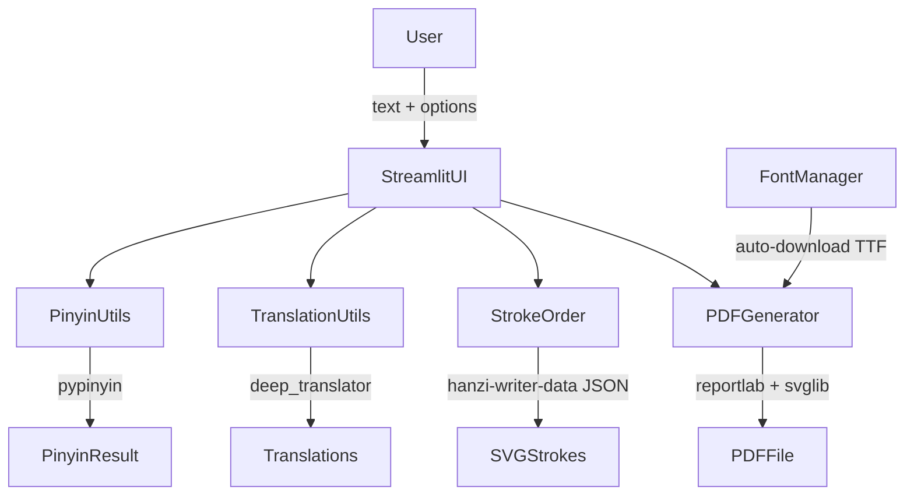

# Chinese Calligraphy Training Sheet Generator

## Architecture




## File Structure

```
app.py                   # Streamlit entry point
requirements.txt
utils/
  fonts.py               # Font download & registration
  stroke_order.py        # Fetch & render stroke sequences as SVG
  pinyin_utils.py        # pypinyin wrapper
  translation.py         # deep_translator EN + RU
  pdf_generator.py       # Full sheet layout with reportlab
fonts/                   # Auto-downloaded TTF files
stroke_cache/            # Cached stroke JSON per character
```

## Calligraphy Styles & Fonts

Each style maps to a downloadable free/open-source TTF:

- **楷书 Kǎishū** (Standard Script) — [Ma Shan Zheng](https://github.com/googlefonts/mashanzheng) — OFL-1.1
- **行书 Xíngshū** (Semi-cursive) — [Zhi Mang Xing](https://github.com/googlefonts/zhimangxing) — OFL-1.1
- **草书 Cǎoshū** (Cursive/Grass) — [Liu Jian Mao Cao](https://github.com/googlefonts/liujianmaocao) — OFL-1.1
- **隶书 Lìshū** (Clerical) — [ZCOOL QingKe HuangYou](https://github.com/googlefonts/zcool-qingke-huangyou) — OFL-1.1
- **篆书 Zhuànshū** (Seal Script) — [Qiji Zhongshan Seal](https://github.com/jeffi369/JFZSKSealScript) — OFL-1.1

Fonts are downloaded once automatically on first run and cached in `fonts/`.

## Stroke Order Data

Source: **hanzi-writer-data** (GitHub: [chanind/hanzi-writer-data](https://github.com/chanind/hanzi-writer-data)). Each character has a JSON with `strokes` (SVG path strings) and `medians`.

Strategy: fetch `https://cdn.jsdelivr.net/npm/hanzi-writer-data@latest/{unicode_codepoint}.json` per character, cache locally. Render a sequence of N small SVGs (stroke 1, strokes 1–2, …, all strokes) using `svglib` for embedding in the PDF.

## PDF Sheet Layout (per character/word)

```
┌────────────────────────────────────────────────────┐
│  Style label (楷书 Kǎishū)                          │
│                                                    │
│  ┌──────────┐  ┌─────────────────────────────────┐ │
│  │          │  │ Stroke order:                   │ │
│  │ 大 LARGE │  │ [1][1+2][1+2+3][1+2+3+4] ...   │ │
│  │ char     │  └─────────────────────────────────┘ │
│  │ (120pt+) │  Pinyin: dà                          │ │
│  └──────────┘  EN: big / large                     │ │
│                RU: большой                          │ │
├────────────────────────────────────────────────────┤
│  Practice rows (田字格 or 米字格 grid)               │
│  ┌──┐ ┌──┐ ┌──┐ ┌──┐ ┌──┐ ┌──┐ ┌──┐ ┌──┐         │ │
│  │  │ │  │ │  │ │  │ │  │ │  │ │  │ │  │         │ │
│  └──┘ └──┘ └──┘ └──┘ └──┘ └──┘ └──┘ └──┘         │ │
└────────────────────────────────────────────────────┘
```

Ghost (faded) tracing guide characters fill the first 1–2 practice cells.

## Streamlit UI Sections

1. **Text input** — free text (characters, words, or short phrases)
2. **Style selector** — radio buttons for 5 styles + "All styles (one per page)"
3. **Options panel** (checkboxes):
  - Show stroke order
  - Show pinyin
  - Show English translation
  - Show Russian translation
4. **Grid type** — 田字格 / 米字格 / plain square
5. **Practice rows** — slider (1–6)
6. **Character size** — slider for large display (80–200pt)
7. **Preview** — rendered preview of first page inside Streamlit
8. **Download PDF** button

## Key Dependencies (requirements.txt)

```
streamlit
svglib
pypinyin
deep-translator
requests
Pillow
```

## Setup & Run

Uses the `torchgpu2` conda environment:

```bash
conda activate torchgpu2
pip install -r requirements.txt
streamlit run app.py
```

## Implementation Notes

- PDF paper size: A4 (210×297 mm), portrait
- For multi-character input (phrases), each character gets its own large display cell; practice rows span the phrase
- If stroke order data is unavailable for a character (e.g. rare seal-script char), the section is gracefully omitted
- Translation caching: results cached in a dict per session to avoid repeated API calls
- The seal script font has ~2,300 characters; a fallback to Standard Script is used for missing glyphs

