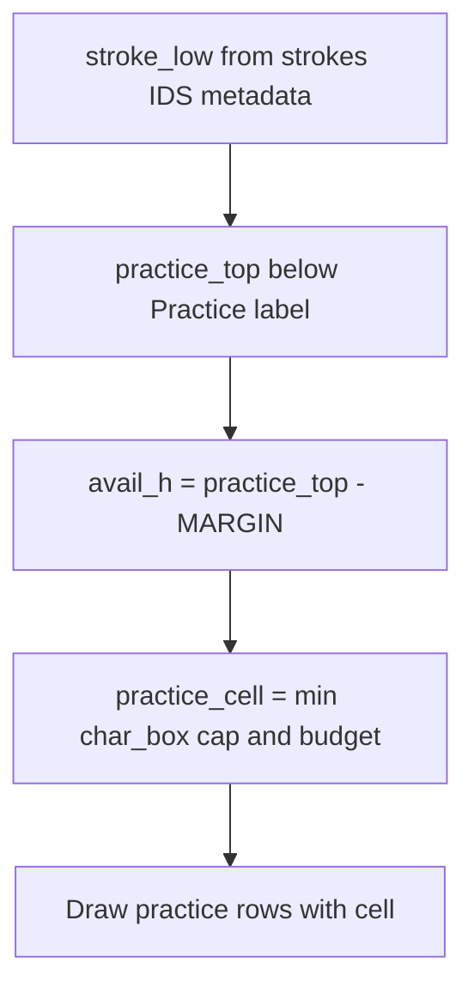

# Phrase layout, practice scaling, compact labels, MMH gloss

## Problem summary

- In [`utils/pdf_generator.py`](g:\Мой диск\Китайский язык\Training sheets generator\utils\pdf_generator.py) `_draw_phrase_page`, the practice grid uses `cell_size = char_box_size` (lines 427–428). The stroke-order + IDS + radical block can push `stroke_low` very low; the loop at 433–436 breaks when `row_y < MARGIN`, so **no practice rows** appear.
- `cells_per_row = int((usable_w + gap) // (cell_size + gap))` (428–429) ignores phrase length `n`. For **n=2** and large cells you get **3** columns → ghost pattern `ch0, ch1, ch0` (1.5 “words”), which looks wrong.
- [`app.py`](g:\Мой диск\Китайский язык\Training sheets generator\app.py) fixes minimum character size at **80 pt** (line 205), which is large for dense sheets.

## 1. Rescale practice cells to fit vertical budget (phrase + character)

**After** all content above “Practice:” has fixed `stroke_low` (and analogously on `_draw_character_page`), compute:

- `practice_top = stroke_low - practice_header_gap` (existing `5 * mm` + “Practice:” line).
- `avail_h = practice_top - MARGIN - bottom_padding` (e.g. 8–10 pt safety).
- Required height for `practice_rows` rows:  
  `need(practice_cell) = practice_rows * practice_cell + (practice_rows - 1) * row_gap` (reuse existing `2 * mm` between rows).

**Solve for `practice_cell`:**  
`practice_cell = min(char_box_size, floor((avail_h - (practice_rows-1)*row_gap) / practice_rows))`,  
then clamp to a **floor** (e.g. 16–20 pt) and **ceiling** (`char_box_size`). If `avail_h` is still too small for one row at `floor`, set `practice_cell = floor` anyway so **at least one row** draws (user priority); optionally cap `effective_rows = min(practice_rows, max_rows_that_fit)` if you want to avoid overlapping the bottom margin (document behavior in README).

Apply the same idea on **`_draw_character_page`** where practice uses `cell_size = char_box_size` (586–587): recompute `cell_size` from `stroke_low` and `practice_rows` so large strokes + metadata do not erase the grid.

**Files:** [`utils/pdf_generator.py`](g:\Мой диск\Китайский язык\Training sheets generator\utils\pdf_generator.py) (two functions; small shared helper e.g. `_practice_cell_size(avail_h, practice_rows, char_box_cap, gap_between_rows)` in the same module).

## 2. Phrase practice: prefer full phrase widths in a row

Replace raw `cells_per_row = max(1, int(...))` with:

- `max_cells = max(1, int((usable_w + gap) // (practice_cell + gap)))` (using **final** `practice_cell` from step 1).
- `n = len(phrase_chars)`.
- **`cells_per_row = max(n, (max_cells // n) * n)`** when `(max_cells // n) * n >= n`, else **`cells_per_row = max_cells`** (fallback when fewer than one full phrase fits).

This yields **2** cells for **最后** when 3 would only show 1.5 repetitions, and **6** when `max_cells` is 7 and `n=3`, etc.

Ghost indexing stays `phrase_chars[col % n]`.

**File:** [`utils/pdf_generator.py`](g:\Мой диск\Китайский язык\Training sheets generator\utils\pdf_generator.py) `_draw_phrase_page` practice section.

## 3. Lower minimum character display size

- In [`app.py`](g:\Мой диск\Китайский язык\Training sheets generator\app.py), change the slider e.g. **`min_value=32`** or **`40`**, **`max_value=200`**, **`step=5`** (or keep step 10 if you prefer coarser control).
- Sanity-check that very small sizes still render; [`_draw_character_page`](g:\Мой диск\Китайский язык\Training sheets generator\utils\pdf_generator.py) uses `char_size_pt` directly for the main glyph—no hard failure expected.

## 4. Compact metadata: 3 columns, fallback to stacked rows

**Scope:** Phrase page first (full `usable_w`); character page can reuse the same helper if the strip is drawn at **full width** under the header block (otherwise the right column is too narrow for 3 columns).

**Behavior:**

- Build three strings (labels optional): Pinyin, EN, RU (skip empty).
- **Attempt one “band”:** split `usable_w` into 3 columns (equal thirds or weighted), font ~8–9 pt for “large display” mode (`char_size_pt` or `inner_fs` above a threshold), draw truncated text per column using `canvas.stringWidth` + binary search or character truncation to **column width**.
- **Fallback:** if any single line would exceed column height (e.g. long Russian) **or** total string width forces unreadable truncation, fall back to the **current** stacked layout (3 lines: Pinyin, EN, RU).

**Implementation sketch:** helper `_draw_phrase_metadata_compact(c, usable_w, margin_x, baseline_y, ...)` returning **new `info_y`** / consumed height; phrase page calls it instead of the sequential `drawString` block (331–353).

**File:** [`utils/pdf_generator.py`](g:\Мой диск\Китайский язык\Training sheets generator\utils\pdf_generator.py); optionally [`app.py`](g:\Мой диск\Китайский язык\Training sheets generator\app.py) checkbox “Compact translations (single row when possible)” or auto-enable when `char_size_pt >= 100` to avoid surprising small layouts.

## 5. “Short example from dictionary” for words

**What the project has today**

- [`utils/translation.py`](g:\Мой диск\Китайский язык\Training sheets generator\utils\translation.py): phrase EN/RU via **Google Translate** (not a lexical dictionary with examples).
- [`utils/decomposition.py`](g:\Мой диск\Китайский язык\Training sheets generator\utils\decomposition.py): **Make Me a Hanzi** `dictionary.txt` with **`definition`** per **character**, not per multi-character word and **not** sample sentences.

**Feasible without new corpora**

- Add an optional line for **phrase mode** only, e.g.  
  **`MMH gloss: 小 small; 孩 child; 儿 …`**  
  built by joining each CJK character’s MMH `definition` (first segment before `;` or truncated), with `mmh_entry` / existing table load. This is a **character glossary**, not a sentence example—label it clearly so it is not confused with usage examples.

**If the user wants real usage examples for multi-character words**

- That requires **new data** (e.g. CC-CEDICT with `sentence` fields, or a small curated JSON) or an API—out of scope for a minimal pass; can be a follow-up.

**Files:** [`utils/decomposition.py`](g:\Мой диск\Китайский язык\Training sheets generator\utils\decomposition.py) (e.g. `phrase_mmh_gloss(phrase: str) -> str | None`), [`utils/pdf_generator.py`](g:\Мой диск\Китайский язык\Training sheets generator\utils\pdf_generator.py) (draw under compact/stacked metadata when flag on), [`app.py`](g:\Мой диск\Китайский язык\Training sheets generator\app.py) (checkbox).

## 6. README

- Brief notes: practice cells may shrink below header size to fit the page; phrase practice columns align to **whole-phrase** repeats; new optional MMH gloss line; slider range—update [`README.md`](g:\Мой диск\Китайский язык\Training sheets generator\README.md) in the PDF/layout section.

## Testing (manual)

- Phrase **`小孩儿`** at **120 pt**, strokes + IDS + radicals on: confirm **≥1** practice row and cells visibly smaller than header if needed.
- Phrase **`最后`**, large size: confirm **2** practice cells per row (not 3) when the old layout would pick 3.
- Slider at **40–48 pt**: PDF generates.
- Long EN/RU string: compact row either fits or falls back to 3 stacked lines.
