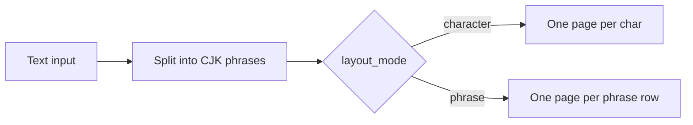

# Phrase training, named typefaces with preview, and word presets

## Current behavior (baseline)

- [`app.py`](g:/Мой диск/Китайский язык/Training sheets generator/app.py) builds `chars` from every non-whitespace character, so `"你好"` becomes two pages.
- [`utils/pdf_generator.py`](g:/Мой диск/Китайский язык/Training sheets generator/utils/pdf_generator.py) loops `for char in chars` and calls `_draw_character_page` once per character (per style when “all styles” is on).

## 1. Phrase-oriented interface and PDF layout

**Goal:** Let users train **whole phrases** (e.g. 你好) on **one sheet** when they want continuity, while keeping **one character per page** as the default for stroke-focused practice.

**Recommended UX**

- Add a **layout mode** control (radio or segmented control):
  - **One page per character** — current behavior; best when stroke order matters per glyph.
  - **One page per phrase** — one horizontal **row of cells** for the whole phrase at readable size; **practice rows** repeat the same phrase (left-to-right), with ghost guides on the first row.
- **Input handling:** Treat user text as one or more **segments** of CJK (and optionally keep digits/ASCII separate or strip). For phrase mode, split on whitespace into **phrases**; each phrase becomes **one PDF page** (if multiple phrases, multiple pages). Example: `你好 谢谢` → 2 phrase pages in phrase mode, or 4 char pages in char mode.
- **Metadata on phrase pages:** Single line **pinyin** for the whole phrase ([`get_pinyin`](g:/Мой диск/Китайский язык/Training sheets generator/utils/pinyin_utils.py)), **EN/RU** via [`get_translations`](g:/Мой диск/Китайский язык/Training sheets generator/utils/translation.py) on the full phrase.
- **Stroke order on phrase pages:** **Keep** stroke-order diagrams (same rules as today: **楷书 / `kaishu` only**, hanzi-writer-data). Do **not** omit them. Use a **compact layout** so the page still fits A4:
  - **Smaller** per-step SVG scale than single-character mode (e.g. lower multiplier vs `char_box_size`, or fixed cap ~20–32 pt step width).
  - **Multiple lines:** For each character in the phrase, render its progressive stroke row(s); **wrap** to the next line when the horizontal strip would exceed `usable_w` (same idea as current `max_per_row`, but with a smaller cell and optional **subsection per character** labeled `你:` / `好:` or a small index).
  - Order sections **top-to-bottom** for char1, char2, … so long phrases (e.g. 4+ chars) stack stroke blocks instead of one impossibly wide row.
  - Reuse [`render_stroke_sequence`](g:/Мой диск/Китайский язык/Training sheets generator/utils/stroke_order.py) + existing Y mapping; only layout constants change in `_draw_phrase_page`.

**Implementation sketch**

- Add `_draw_phrase_page(...)` in [`pdf_generator.py`](g:/Мой диск/Китайский язык/Training sheets generator/utils/pdf_generator.py): compute `cell_size = min(char_box_budget, usable_w / n_chars)` with a floor so 你好 fits on A4; draw `n` bordered boxes in one row; **below** the main phrase row (and below pinyin/EN/RU), add the **stacked compact stroke-order** section as above; then practice section: `practice_rows` × full phrase width (n cells per row).
- Extend `generate_pdf(..., layout_mode: Literal["character","phrase"] = "character")` to branch: phrase mode iterates **phrases** (list of strings), character mode iterates **chars** as today.
- Update [`app.py`](g:/Мой диск/Китайский язык/Training sheets generator/app.py): layout radio; page count preview; pass `layout_mode` into `generate_pdf`.

---

## 2. Typeface choice: names + preview (no “writing instrument” labels)

**User feedback:** Avoid mapping fonts to **ball pen / brush / stub**, etc., because learners may not relate to those tools. Prefer **transparent, honest** selection: **official font name** + **what you will get visually**.

**Model**

- Replace the “tool” axis with a single **expandable typeface catalog**: each entry is a **concrete OFL TTF** (same sources as today: Google Fonts raw URLs, seal script release URL, plus any extra faces you add for variety).
- Each entry exposes:
  - **Display label** — e.g. `Ma Shan Zheng / 马善政` (English + Chinese where useful), or the font’s postscript family name as shown on Google Fonts.
  - **Short optional note** (one line, non-metaphorical) — e.g. “Brush-style script” only if we keep it descriptive of *appearance*, not “use this for a brush”; better: “Bold stroke, display weight” or leave blank.
- **Grouping (optional):** Collapse under script-style **headings** (楷书 / 行书 / …) *or* one flat searchable list — whichever keeps the sidebar scannable. Do **not** use instrument names as group titles.

**Preview (recommended)**

- After the font file exists locally (post-`ensure_font`), generate a **small PNG** with **Pillow** `ImageFont.truetype` + `ImageDraw.text` using sample text **`永你好`** (or user’s first character + fixed sample), white background, black text, fixed height (~48–64 px).
- Show with `st.image` below the font selector so users see the face **before** generating a PDF. This works for **any** downloaded TTF (including seal script from GitHub), unlike CSS `@font-face` which is awkward for arbitrary local files in Streamlit.

**Alternative / supplement**

- If preview image is deferred: show **font full name string** + link to **Google Fonts specimen** (for GF-hosted faces) in `st.caption` — weaker but zero extra deps beyond requests.

**Implementation**

- Refactor [`utils/fonts.py`](g:/Мой диск/Китайский язык/Training sheets generator/utils/fonts.py): a **flat or grouped list** of typeface dicts `{ id, label, filename, url, optional_group }` where `id` replaces the old single `kaishu`/`xingshu`… keys **or** keep script keys and add **multiple** typefaces per script (user picks typeface within 楷书, etc.). Simplest v1: **one global typeface list** (all OFL faces) and deprecate strict 5-style lock-in, *or* keep 5-style radio and add **second select** “Typeface (within this style)” with 1–N options — product choice.
- `ensure_typeface(typeface_id) -> reportlab_font_name` parallel to current `ensure_font(style_key)`.
- [`app.py`](g:/Мой диск/Китайский язык/Training sheets generator/app.py): `st.selectbox` / `st.radio` with **labels showing font names**; render PIL preview on change.
- [`README.md`](g:/Мой диск/Китайский язык/Training sheets generator/README.md): explain that choice is **by typeface name and preview**, not by physical pen type.

---

## 3. Word presets and HSK-style banks

**Goal:** Quick insertion of **themed lists** (numbers, animals, home, family, popularity) and **HSK-oriented** lists without bloating the repo.

**Bundled data (small JSON in repo)**

- Add [`data/presets/`](g:/Мой диск/Китайский язык/Training sheets generator/data/presets/) with files such as `numbers.json`, `animals.json`, `family.json`, `home.json`, `common_phrases.json` — each a list of objects `{ "zh": "...", "note": "optional" }` or plain string arrays.
- Add [`utils/presets.py`](g:/Мой диск/Китайский язык/Training sheets generator/utils/presets.py): `load_preset(name) -> list[str]`, discover available presets from folder.

**HSK**

- **Option A (recommended for v1):** UI: “HSK level” + “Sample size” that picks random or first-N words from a **cached** MIT-licensed JSON (e.g. [drkameleon/complete-hsk-vocabulary](https://github.com/drkameleon/complete-hsk-vocabulary)) downloaded **on first use** into `data/hsk/` (or user cache dir), not committed in full.
- **Option B:** Ship only **HSK 1** top 50 words as `data/presets/hsk1_sample.json` for offline demos.

**UI**

- Sidebar expander **“Word banks”**: `st.selectbox` category → `st.button` **Insert** (append to text area) or **Replace**; optional multiselect for HSK level + word count.
- Show license attribution for HSK data source in README and a one-line caption in UI.

---

## 4. Documentation and scope

- Update [`README.md`](g:/Мой диск/Китайский язык/Training sheets generator/README.md): layout modes, typeface list + previews, preset files, HSK optional download, licensing.
- Keep changes localized: no unrelated refactors; PDF logic split between `_draw_character_page` and new `_draw_phrase_page` only.

## Implementation order (suggested)

1. **Phrase layout** + `generate_pdf` / UI wiring (highest user-visible impact).
2. **Named typefaces + PIL preview** in [`utils/fonts.py`](g:/Мой диск/Китайский язык/Training sheets generator/utils/fonts.py) / [`app.py`](g:/Мой диск/Китайский язык/Training sheets generator/app.py) + README (no instrument metaphors).
3. **Bundled presets** + `utils/presets.py` + Streamlit expander.
4. **HSK optional loader** (if time; can be a follow-up milestone).
